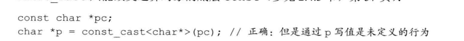

# 第4章

## 4.11 类型转换

### 隐式类型转换

<!--more-->

隐式转换自动执行，隐式转换会尽可能避免精度。

int ival = 3.541+3;

会将3转换成double，结果会转换成int赋值给ival;

### 显式类型转换

强制类型转换具有如下形式：

cast_name<type>(expression)

type:是要转换的类型

cast_name: **static_cast , dynamic_cast , const_cast,  reinterpret_cast** 4种类型转换,dynamic_cast支持运行时类型识别

-----------------------------------------------------------------------------------------------------------------------------

#### static_cast

只要不含底层const，都可以使用，比如

int i ,j;

double slope = static_cast<double>(j)/i;

-----------------------------------------------------------------------------------------------------------------------------

#### const_cast

https://https://www.cnblogs.com/QG-whz/p/4513136.htmlwww.cnblogs.com/QG-whz/p/4513136.html

const_cast改变对象的底层const ，只有const_cast可以改变表达式的常量属性。const_cast只能添加const和删除const特性，不能执行其他任何类型的转换。

尽量避免这种情况，不然会产生未定义的行为。

#### reinterpret_cast

相当于重新解释成其他类型。操作符修改了[操作数](https://baike.baidu.com/item/操作数?fromModule=lemma_inlink)类型,但仅仅是重新解释了给出的对象的比特模型而没有进行[二进制转换](https://baike.baidu.com/item/二进制转换?fromModule=lemma_inlink)。

