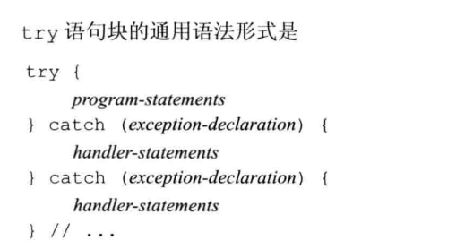
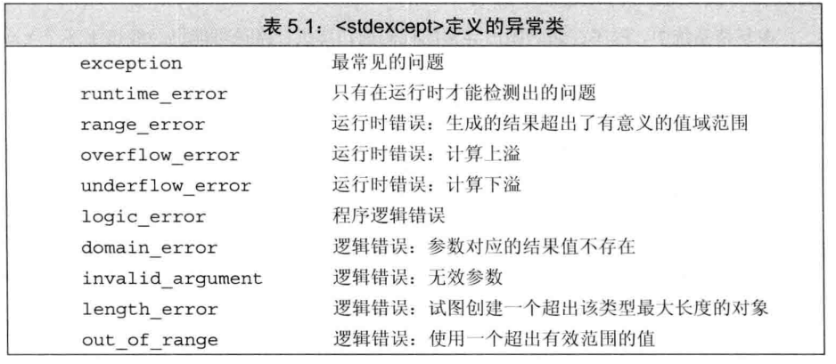
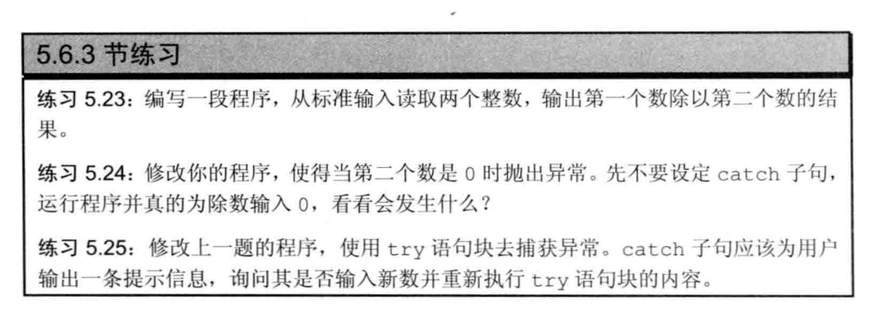

# 第五章

## throw表达式

使用throw表达式引发一个异常。关键字throw后接一个异常类型。比如

~~~c
throw runtime_error("Data must refer to same ISBN");
~~~

<!--more-->

## try语句块

try语句块的通用语法

## 标准异常

C++定义的异常类，分别在4个头文件中。

- exception头文件定义了最通用的异常类exception,只报告异常的发生，不提供额外的信息。
- stdexcept头文件定义了常用的异常类，在表5,1列出
- new头文件定义了bad_alloc异常类型，在12.1.2节详细介绍
- type_info头文件定义了bad_cast异常类型，19.2节详细介绍

## 一个练习

~~~c

int main(int argc , char* argv[]) {
    double a ;
    int b;
    cout<<"input  a:";
    cin>>a;
    while(1)
     {
        try {
            cout<<"input b:";
            cin>>b;
            if(b==0)throw runtime_error("b can not be 0");
            cout<<a/b<<endl;
            break;
        } catch (runtime_error err) {
            cout<<err.what()<<"\n Try again? Enter y or n"<<endl;
            char c;
            cin>>c;
            if(!cin || c == 'n')
            {
                break;
            }
        }

    }

    exit(1);
}
~~~

