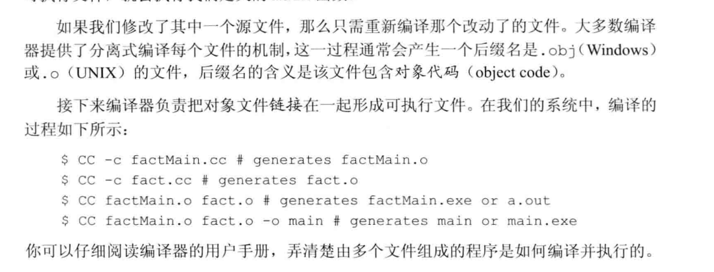

# 第6章 函数

## 局部对象

### 自动对象

形参是一种自动对象，函数一旦终止，形参就被销毁。我们用传递给函数的实参对象初始化形参对应的自动对象。如果变量定义本身含有初始值，就用这个初始值进行初始化；否则执行默认初始化。 

### 局部静态对象

局部静态对象的生命周期贯穿函数调用及之后的时间。**局部静态对象**在程序的执行路径第一次经过对象定义语句时初始（后面就会跳过这个初始化语句），知道程序终止才被销毁。

<!--more-->

## 分离式编译

分离式编译允许我们将程序分割道几个文件中去，每个文件单独编译。

### 编译和链接多个源文件

在名为factMain.cc文件中创建main函数，main函数将用到fact函数，在fact.cc中。如果只修改了其中一个源文件，只需要重新编译那个改动了的文件。

## 参数传递

这个比较简单，引用传递，传递指针，传递值。

### 一些思考

- **在一个函数返回值的时候（比如一个类或者其他的），在调用它的程序中得到的还是那个返回的值吗？**
- **在向一个函数进行值传递的时候，那么在函数中进行修改，原来本身传递进去的值是不会被修改的，所以如果传递的是一个类，那么是会生成一个类吗**？

~~~C++
using namespace  std;
class  TT
{
public:
    TT(int a)
    {
        cout<<this<<" constructor"<<endl;
    }
    TT& operator=(const TT t)
    {
        cout<<"operator ="<<endl;
    }
    ~TT()
    {
        cout<<this<<" destructor"<<endl;
    }

};
TT getClass(TT T2)
{
    cout<<"getClass T2 "<<&T2<<endl;
    return T2;
}
int main(int argc , char* argv[]) {
    TT T2(2);

    TT T3 = getClass(T2);
    cout<<"main T2 "<<&T2<<endl;
    cout<<"main T3 "<<&T3<<endl;

    exit(1);
}

~~~

得到结果

~~~
0x61ff0e constructor
getClass T2 0x61ff0f
0x61ff0f destructor
main T2 0x61ff0e
main T3 0x61ff0d
~~~

可以知道值传递的话，传入的类和接收的类不是一个类。且函数局部变量会销毁。***但是构造函数只调用了一次，难道是开辟了新的内存空间然后对内存进行了复制。***

### const和实参

虽然C++有函数重载但是会忽略顶层const，如

~~~
void fcn(const int i ){}
void fcn(int i){}
~~~

这两个就是错误的，相当于重复定了

