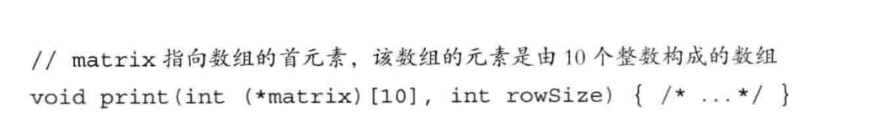
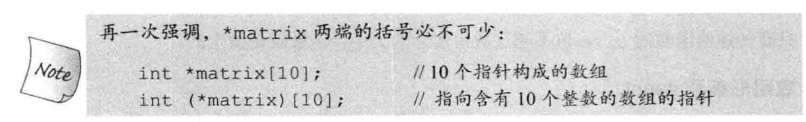
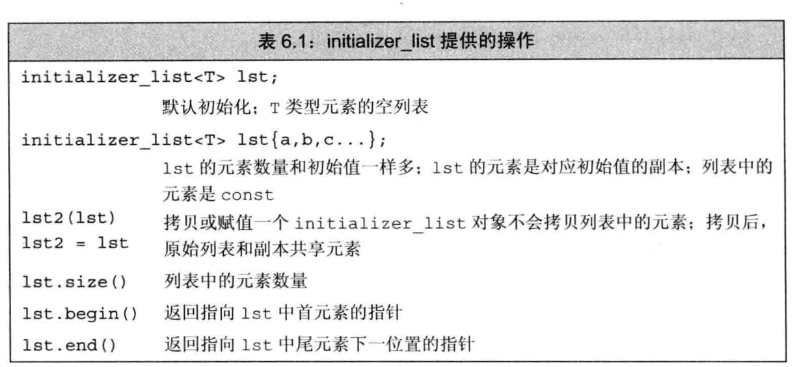
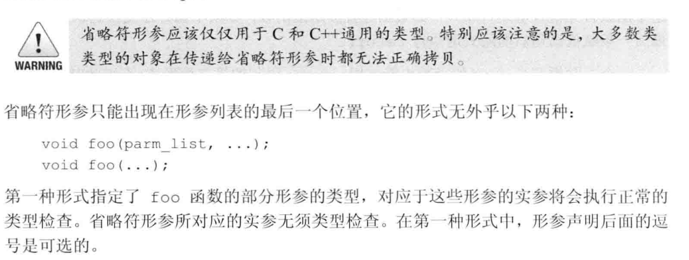
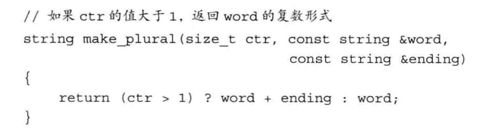
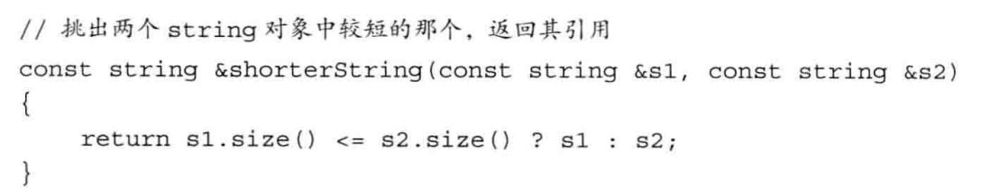
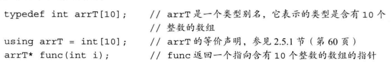
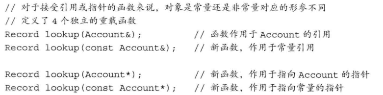
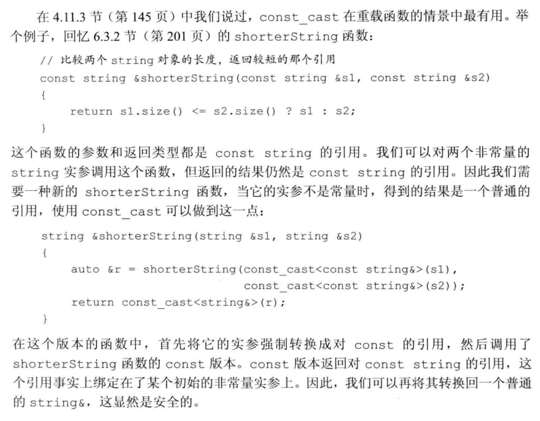

# 第6章 函数

## 局部对象

### 自动对象

形参是一种自动对象，函数一旦终止，形参就被销毁。我们用传递给函数的实参对象初始化形参对应的自动对象。如果变量定义本身含有初始值，就用这个初始值进行初始化；否则执行默认初始化。 

### 局部静态对象

局部静态对象的生命周期贯穿函数调用及之后的时间。**局部静态对象**在程序的执行路径第一次经过对象定义语句时初始（后面就会跳过这个初始化语句），知道程序终止才被销毁。

<!--more-->

## 分离式编译

分离式编译允许我们将程序分割道几个文件中去，每个文件单独编译。

### 编译和链接多个源文件

在名为factMain.cc文件中创建main函数，main函数将用到fact函数，在fact.cc中。如果只修改了其中一个源文件，只需要重新编译那个改动了的文件。

## 参数传递

这个比较简单，引用传递，传递指针，传递值。

### 一些思考

- **在一个函数返回值的时候（比如一个类或者其他的），在调用它的程序中得到的还是那个返回的值吗？**
- **在向一个函数进行值传递的时候，那么在函数中进行修改，原来本身传递进去的值是不会被修改的，所以如果传递的是一个类，那么是会生成一个类吗**？

~~~C++
using namespace  std;
class  TT
{
public:
    TT(int a)
    {
        cout<<this<<" constructor"<<endl;
    }
    TT& operator=(const TT t)
    {
        cout<<"operator ="<<endl;
    }
    ~TT()
    {
        cout<<this<<" destructor"<<endl;
    }

};
TT getClass(TT T2)
{
    cout<<"getClass T2 "<<&T2<<endl;
    return T2;
}
int main(int argc , char* argv[]) {
    TT T2(2);

    TT T3 = getClass(T2);
    cout<<"main T2 "<<&T2<<endl;
    cout<<"main T3 "<<&T3<<endl;

    exit(1);
}

~~~

得到结果

~~~
0x61ff0e constructor
getClass T2 0x61ff0f
0x61ff0f destructor
main T2 0x61ff0e
main T3 0x61ff0d
~~~

可以知道值传递的话，传入的类和接收的类不是一个类。且函数局部变量会销毁。这里调用的就是拷贝构造。

### 6.2.3 const和实参

虽然C++有函数重载但是会忽略顶层const，如

~~~
void fcn(const int i ){}
void fcn(int i){}
~~~

这两个就是错误的，相当于重复定了

#### 尽量使用常量引用

防止不必要的修改，以及不能将const对象、字面值或者需要类型转换的对象传递给普通的参数引用。

### 6.2.4 数组形参

### 6.2.5处理命令行选项

main函数中argc表示传入命令参数的个数，argv就是指向C风格字符串的指针数组。

### 6.2.6含有可变形参的函数

有时无法提前预知应该向函数传递几个实参。C++提供了2中方法：

- 名为initializer_list的标准库模板；
- 如果实参类型不同，可以写一种特殊的函数，16.4节将展开介绍
- 还有一种特殊的形参类型即省略符，用其传递可变数量的实参。一般只用于C函数交互的接口程序。

#### initializer_list形参

函数实参数量未知但是类型相同，可以使用initializer_list类型的实参。initializer_list定义在同名的头文件中。

initializer_list对象中的元素永远是常量值，我们无法进行修改。如果想向一个initializer_list形参传递一个值得序列，则必须把序列放在一对花括号内：

~~~c
//expected 和actual是string对象
if(expected != actual)
	error_msg({"functionX",expected,actual});
else
error_msg({"functionX","okay"});
~~~

含有initializer_list形参的函数也可以含有其他形参，如：

#### 省略符形参

为了便于C++程序访问某些特殊的C代码设置，这些代码 使用了名为varargs的C标准库功能。

### 6.3.2返回类型和return语句

返回值类型必须与函数的返回类型相同，或者能够隐式的转换成函数的返回类型。

#### 值是如何被返回的

返回一个值的方式和初始化一个变量或形参的方式完全一样：返回的值用户初始化调用点的一个临时量，该临时量就是函数调用的结果。

该函数的返回类型是string,意味着返回值将被**拷贝**到调用点。因此该函数将返回word的副本和一个未命名的临时string对象，该对象的内容是word和ending的和。

*如果返回的是引用*：形参和返回值都是const string的引用，所以不会真正拷贝string对象。

#### 不要返回局部对象的引用或指针

函数完成，占用的存储空间也会被释放，指向就不再有效。

#### 返回类类型的函数和调用运算符

#### 引用返回左值

函数返回类型决定函数调用是否是左值，调用一个返回引用的函数得到左值，其他的得到右值。

- 什么是左值：可以取地址的，有名称的，非临时的是左值
- 不可以取地址，匿名的，临时的是右值

也就是说如果返回的不是引用，那么返回值会被销毁。

#### 列表初始化返回值

C++11新标准规定，函数可以返回花括号包围的值列表。此处列表表示用来表示对返回的临时变量进行初始化。如果为空执行值初始化；否则有返回函数的返回类型决定。

### 6.3.3返回数组指针

数组不能拷贝，所以函数不能返回数组。但可以返回数组的指针或引用。

#### 声明一个返回数组指针的函数

返回数组指针的的函数形式如下：

Type (*function(parameter_list))[dimension]

比如

~~~c
int (*func(int i ))[10]
~~~

#### 使用尾置返回类型

在形参列表后面并以一个->符号开头，在本该出现返回类型的地方防止一个auto :

~~~c
auto func(int i) ->int(*)[10];
~~~

#### 使用decltype

~~~c++
int odd[]={1,3,5};
int even[] ={0,2,4};
decltype(odd) *arrPtr(int i )
{
	returtn (i%2) ?& odd:&even;
}
~~~

arrPtr返回一个指向含有5个整数的数组的数组。

### 函数重载

函数名字相同但形参列表不同称为函数重载。

#### 重载和const形参

如6.2.3节介绍的，顶层const不影响传入函数的对象。所以顶层const无法进行函数重载。

如果形参是指针或引用，通过指向是常量还是非常量可以实现函数重载。此时const是底层的：

因为const不能转换成其它类型，只能把const对象（或者指向const的指针）传递给const形参。因为非常量可以转成const，所以上面的4个函数都可以作用于非常量对象或指向非常量对象的指针。如果传入一个非常量对象或者非常量对象的指针时，编译器会选用非常量版本的函数。

#### const和重载

#### 调用重载的函数

当两个重载函数参数数量相同且参数类型可以互相转换的时候，编译器的处理方法：

- 找到一个最佳匹配
- 无匹配
- 有多于一个函数可以匹配，但是每一个都不是最佳选择。也发生错误，称为二义性调用。

### 6.4.1重载与作用域

在内层作用域种声明名字，讲隐藏外层作用域种的同名实体。

### 6.5特殊用途语言特性

介绍三种函数相关的语言特性：默认参数、内联函数、constexpr函数

#### 6.5.1默认实参

##### 使用默认实参调用函数

就是参数附上了默认值。

##### 默认实参声明

##### 默认实参初始值

局部变量不能作为初始值

#### 6.5.2内联函数和constexpr函数

在函数返回类型前面加上inline就可以了，但是递归不支持。

##### constexpr函数

constexpr指常用于常量表达式的函数。

定义constexpr需要遵循的几项约定：

- 函数的返回类型为字面值类型
- 函数体种只有一条return 语句

constexpr函数被隐式的指定为内联函数。

#### 把内联函数和constexpr函数放在头文件内

### 6.5.3调试帮助

开发时用到的代码，准备发布时屏蔽掉代码。要用到的功能：assert和NDEBUG。

#### assert预处理宏

assert是一种预处理宏，类似预处理变量。表达式：

assert(expr)

对expr求值，如果表达式为假，assert输出信息并终止程序的执行。非0的话，什么也不做。预处理名字又预处理器而不是编译器管理，所以可以直接使用，和预处理变量一样，宏名字在程序内必须唯一。

#### NDEBUG预处理变量

如果定义了NDEBUG，则assert就什么都不做。也可以使用NDEBUG编写自己的条件调试代码。

~~~c++
void print(const int ia[],size_t size)
{
    #ifndef NDEGBU
    //__func__是编译器定义的一个局部静态变量，用于存放函数的名字
    cerr<<__func__<<":arrat size is"<<size<<endl;
}
~~~

预处理还定义了4个对于调试程序很有用的名字：

~~~c++
__LINE__ 存放文件名的字符串字面值
__FILE__ 存放当前行号的整型字面值
__TIME__ 存放文件编译时间的字符串字面值
__DATE__ 存放文件编译日期的字符串字面值
~~~

