# 第二章 调试前的必知必会

本章学习GDB使用方法、intel架构的基础、栈的基础知识、函数调用时的参数传递方式、汇编语言的学习方法。

## 获取进程的内核转储

### 什么式内核转储

**wiki的解释:**

<!--more-->

In [computing](https://en.wikipedia.org/wiki/Computing), a **core dump**,[[a\]](https://en.wikipedia.org/wiki/Core_dump#cite_note-1) **memory dump**, **crash dump**, **storage dump**, **system dump**, or **ABEND dump**[[1\]](https://en.wikipedia.org/wiki/Core_dump#cite_note-2) consists of the recorded state of the working [memory](https://en.wikipedia.org/wiki/Computer_storage) of a [computer program](https://en.wikipedia.org/wiki/Computer_program) at a specific time, generally when the program has [crashed](https://en.wikipedia.org/wiki/Crash_(computing)) or otherwise terminated abnormally.[

就是在进程崩溃的时候将相关信息进行记录（内存，寄存器状态，堆栈指针，内存管理），生成core dump文件。

## 启用内核转储

~~~bash
ulimit -c
~~~

-c选项表示内核转储文件的大小限制。如果是0，表示内核转储无效。

~~~
ulimit -c unlimited
~~~

上述是将内核转储设置为无限制，也可以加上数字限制大小，单位是字节。

**Ubuntu无法生成core文件，需要进行设置。**

a.c文件代码如下

~~~
#include<stdio.h>
int main(void)
{
    int *p = NULL;
    *p = 0x1;
    return 0;
}
~~~

执行a.out文件

~~~
Segmentation fault (core dumped)
~~~

得到内核转储文件

~~~bash
ubuntu@VM-4-3-ubuntu:/home/gdbLearning$ file core*
core: ELF 64-bit LSB core file, x86-64, version 1 (SYSV), SVR4-style, from './a.out', real uid: 1000, effective uid: 1000, real gid: 1000, effective gid: 1000, execfn: './a.out', platform: 'x86_64'
~~~

执行gdb

~~~c
ubuntu@VM-4-3-ubuntu:/home/gdbLearning$ gdb -c core ./a
GNU gdb (Ubuntu 9.2-0ubuntu1~20.04.1) 9.2
Copyright (C) 2020 Free Software Foundation, Inc.
License GPLv3+: GNU GPL version 3 or later <http://gnu.org/licenses/gpl.html>
This is free software: you are free to change and redistribute it.
There is NO WARRANTY, to the extent permitted by law.
Type "show copying" and "show warranty" for details.
This GDB was configured as "x86_64-linux-gnu".
Type "show configuration" for configuration details.
For bug reporting instructions, please see:
<http://www.gnu.org/software/gdb/bugs/>.
Find the GDB manual and other documentation resources online at:
    <http://www.gnu.org/software/gdb/documentation/>.

For help, type "help".
Type "apropos word" to search for commands related to "word"...
Reading symbols from ./a...
(No debugging symbols found in ./a)
[New LWP 4141606]
Core was generated by `./a'.
--Type <RET> for more, q to quit, c to continue without paging--c
Program terminated with signal SIGSEGV, Segmentation fault.
#0  0x000055b86b8b013d in main ()
~~~

没有像书上显示那行出现错误，将代码重新编译，加上调试选项g

~~~bash
ubuntu@VM-4-3-ubuntu:/home/gdbLearning$ gcc a.c -g -o a
ubuntu@VM-4-3-ubuntu:/home/gdbLearning$ ./a
Segmentation fault (core dumped)
~~~

这次就可以定位道哪一行了

~~~bash
ubuntu@VM-4-3-ubuntu:/home/gdbLearning$ gdb -c core ./a
GNU gdb (Ubuntu 9.2-0ubuntu1~20.04.1) 9.2
Copyright (C) 2020 Free Software Foundation, Inc.
License GPLv3+: GNU GPL version 3 or later <http://gnu.org/licenses/gpl.html>
This is free software: you are free to change and redistribute it.
There is NO WARRANTY, to the extent permitted by law.
Type "show copying" and "show warranty" for details.
This GDB was configured as "x86_64-linux-gnu".
Type "show configuration" for configuration details.
For bug reporting instructions, please see:
<http://www.gnu.org/software/gdb/bugs/>.
Find the GDB manual and other documentation resources online at:
    <http://www.gnu.org/software/gdb/documentation/>.

For help, type "help".
Type "apropos word" to search for commands related to "word"...
Reading symbols from ./a...
[New LWP 4142268]
Core was generated by `./a'.
Program terminated with signal SIGSEGV, Segmentation fault.
--Type <RET> for more, q to quit, c to continue without paging--c
#0  0x000055c1ad41313d in main () at a.c:5
5           *p = 0x1;
(gdb) 
~~~

## 在专用目录生成内核转储

在 /etc/sysctl.conf加上如下两行

~~~bash
kernel.core_pattern = /var/core/%t-%e-%c.core
kernel.core_uses_pid = 1
~~~

执行 

~~~bash
sysctl -p
~~~

在执行a文件，就会在var/core下生成内核转储文件，可能没有core这个目录，需要我们创建然后给予权限 ，生成格式如下：

生成内核转储的时刻-进程名-PID-内核转储最大大小.core

~~~
1666190088-a-4145628-18446744073709551615.core
~~~

在kernel.core_pattern中可以设置的格式符如表2-1所示。

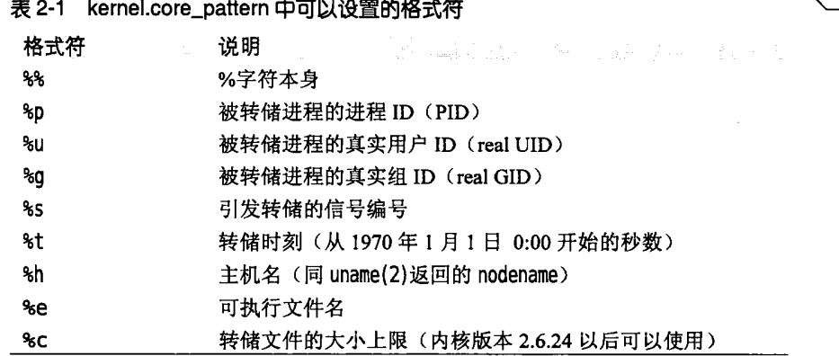

如何将kernl.core_uses_pid =0设置为1，文件名末尾就会添加.PID(需要将kernel.core_pattern中的%p去掉)

后面还有使用用户模式辅助程序自动压缩内核转储文件，以及启动整个系统的内核转储功能，利用内核转储掩码排除共享内存，这些用到再说吧。

## 调试器（GDB）的基本使用方法（之一）

本hack说明GDB的基本使用方法，包括断点设置、继续运行等。

使用Linux下的标准调试器GDB，编译器为GCC。

流程如下 ：

1.带着调试选项编译、构建调试对象

2.启动调试器（GDB）

2-1设置断点

2-2显示栈帧

2-3显示值

2-4继续执行

### 准备

通过gcc的-g选项生成调试信息

~~~C
gcc -Wall -O2 -g 源文件
~~~

如果是Makefile构建，一般要给CFLAGS中指定-g选项

~~~
CFLAGS = -wall -O2 -g 
~~~

### 启动

~~~
gdb 可执行文件名
~~~

### 设置断点

break 设置，可简写为b,格式如下

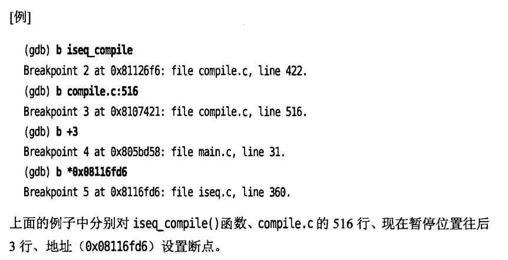

不指定断点位置，就在下一行代码设置断点。

设置好的断点可以通过info break确认

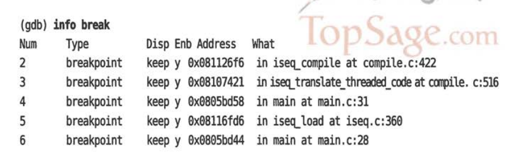

### 运行

用run命令开始运行，不加参数只执行run，就会执行到断点位置后暂停，可以简写为r。

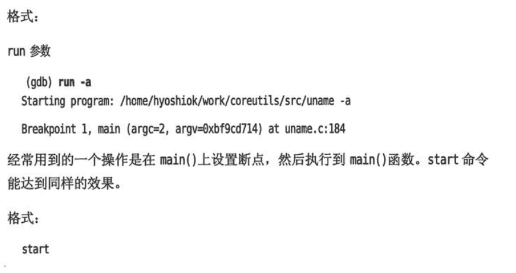

###  显示栈帧

breaktrace：遇到断点暂停执行时显示栈帧。可以简写为bt。别名还有where 和info stack(简写为info s)。

~~~
bt 显示所有栈帧
bt N 显示开头N个栈帧
bt -N 只显示最后N个栈帧

下面是不仅显示backtrace，还要显示局部变量。N与前面几个意思相同。
bt full 
bt full N
bt full -N
~~~

### 显示变量

print显示变量，可以简写为p

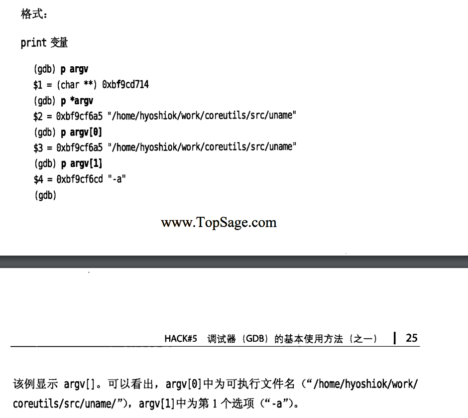

### 显示寄存器

info registers 可显示寄存器，简写为info reg

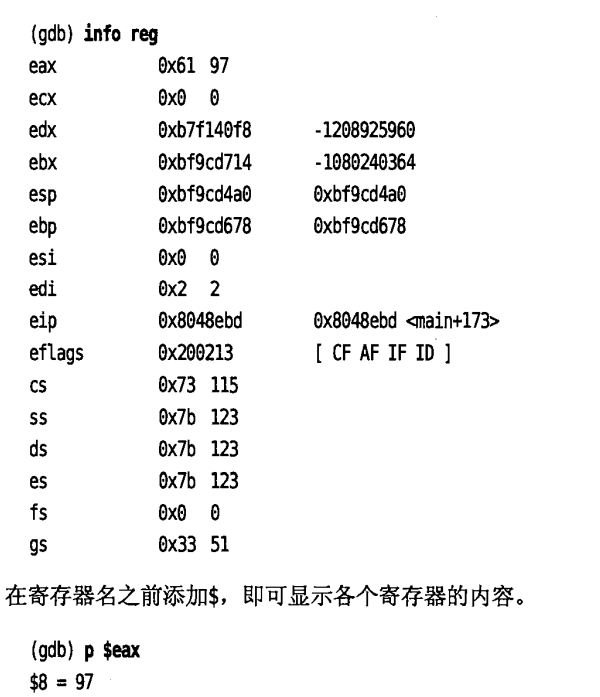

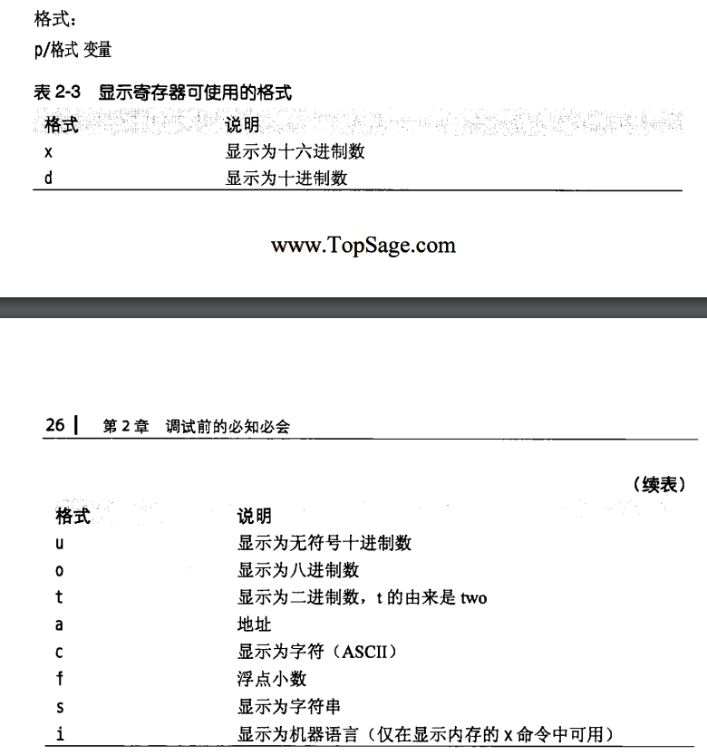

程序指针可以写为$pc或者$eip

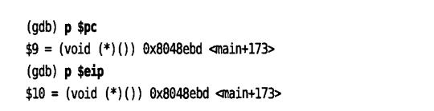

用x命令可以显示内存的内容。

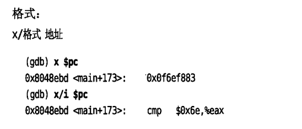

使用x命令时，格式为x/NFU ADDR,此处ADDR为希望显示的地址，N为重复次数，F为前面讲过的格式（x d u o t a c f s i）,U为表2-4所示的单位。

下面显示从pc所指地址开始的10条指令（i）

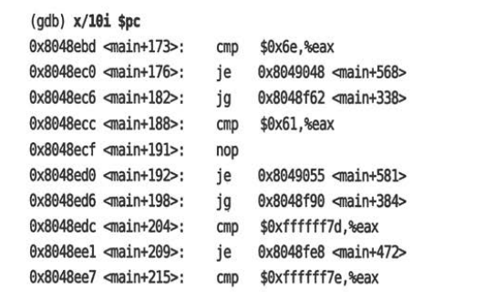

反汇编命令disassemble,简写为disas,格式

1.disassemble 

2.disassemble 程序计数器

3.disassemble 开始地址 结束地址

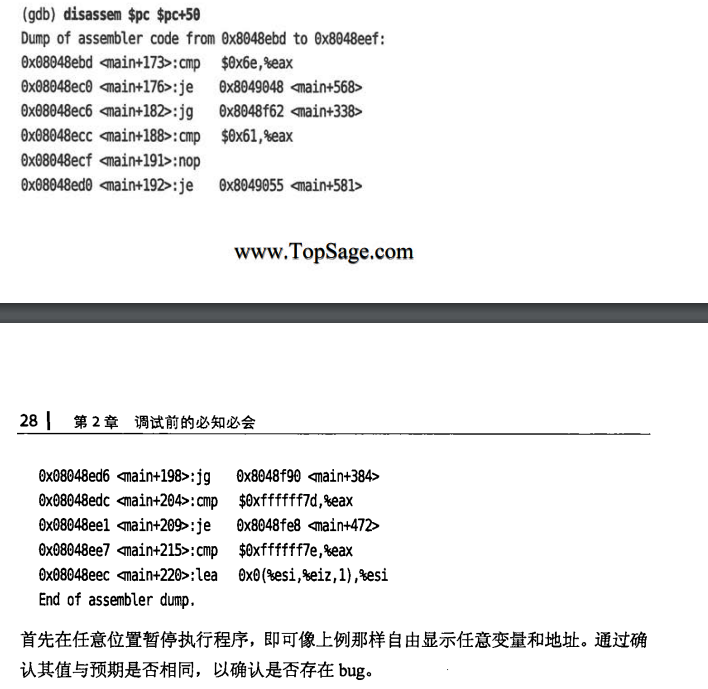

### 单步执行

执行源代码中一行的命令为next,如果遇到函数调用，可以使用step（简写为p）命令。

如果要执行nexti和stepi命令，就是逐条执行汇编指令。

### 继续运行

continue,简写为c

continue 次数

指定次数可以忽略断点

### 监视点

找到变量在何处被改变，使用watch命令

~~~
watch <表达式> 发生变化时暂停
awatch <表达式> 被访问、改变时暂停运行
rwatch <表达式> 被访问时候暂停运行

~~~

### 删除断点和监视点

用delete命令删除断点和监视点

~~~
delete <编号> 删除<编号>指示的断点和监视点。
~~~

### 改变变量的值

~~~
set variable <变量> = <表达式>
~~~

### 生成内核转储文件

~~~
generate-core-file
~~~

还有gcore命令可以从命令行直接生成内核转储文件

~~~
gcore 'pidof emacs'
~~~

该命令无须停止就可以获得内核转储文件。

## 调试器（GDB）的基本使用方法（之二）

这个部分介绍GDB的一些使用技巧

## attach到守护进程

调试守护进程（daemon process）等已启动进程，或是陷入死循环的进程，用attach命令

格式

~~~
attach pid
~~~

查看进程ID可以用ps命令，下面以sleep为例进行调试，我用自己写的一个文件进行测试

a.c

~~~c
#include<stdio.h>
#include<unistd.h>
int main(void)
{

    while(1)
    {
        sleep(1);
        printf("sleep 100\n");
    }
    return 0;
}
~~~

使用ps aux 得到进程ID

~~~
ubuntu    276238  0.0  0.0   2488   576 pts/7    S+   10:41   0:00 ./a
~~~

使用attach 276238进行调试

输入sudo gdb进入gdb

输入命令 attach 276238

~~~shell
(gdb) attach 276238
Attaching to process 276238
Reading symbols from /home/gdbLearning/a...
Reading symbols from /lib/x86_64-linux-gnu/libc.so.6...
Reading symbols from /usr/lib/debug/.build-id/18/78e6b475720c7c51969e69ab2d276fae6d1dee.debug...
Reading symbols from /lib64/ld-linux-x86-64.so.2...
Reading symbols from /usr/lib/debug/.build-id/45/87364908de169dec62ffa538170118c1c3a078.debug...
0x00007fb31594c1b4 in __GI___clock_nanosleep (clock_id=<optimized out>, clock_id@entry=0, flags=flags@entry=0, 
    req=req@entry=0x7fff9fd94c00, rem=rem@entry=0x7fff9fd94c00) at ../sysdeps/unix/sysv/linux/clock_nanosleep.c:78
78      ../sysdeps/unix/sysv/linux/clock_nanosleep.c: No such file or directory.
~~~

输入bt显示栈帧

~~~
(gdb) bt
#0  0x00007fb31594c1b4 in __GI___clock_nanosleep (clock_id=<optimized out>, clock_id@entry=0, flags=flags@entry=0, 
    req=req@entry=0x7fff9fd94c00, rem=rem@entry=0x7fff9fd94c00) at ../sysdeps/unix/sysv/linux/clock_nanosleep.c:78
#1  0x00007fb315951ec7 in __GI___nanosleep (requested_time=requested_time@entry=0x7fff9fd94c00, remaining=remaining@entry=0x7fff9fd94c00)
    at nanosleep.c:27
#2  0x00007fb315951dfe in __sleep (seconds=0) at ../sysdeps/posix/sleep.c:55
#3  0x000056451fae117b in main () at a.c:8
~~~

**栈帧得从下往上看**，可以知道先进入了main,然后调用了sleep()函数，sleep函数调用了nanosleep ().

atattch之后就可以使用普通得gdb命令了。

## 条件断点

仅在特定条件下中断

格式

- break 断点 if  条件

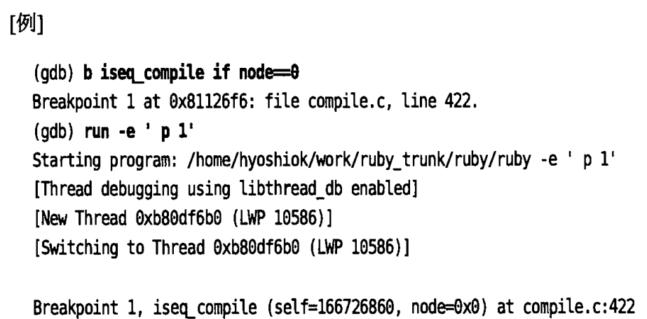

格式

- condition 断点编号
- condition 断点编号 条件

condition命令可以给指定的断点添加或删除触发条件。

- 第一个格式删除指定断点编号的触发条件
- 第2个格式给断点添加触发条件

## 反复执行

格式

- ignore 断点编号 次数

在编号指定的断点、监视点、捕获点忽略指定的次数。continue也是一样的。

格式

- continue 次数
- step 次数
- stepi 次数
- next 次数
- nexti 次数

格式

- finish
- until
- until 地址

finish:执行完当前函数后暂停

until:执行完当前函数等代码块后暂停，如果是循环则跳出循环

## 删除断点和禁用断点

clear删除已定义的断点，只是禁用的话可以使用disable，重新启用的话使用enable命令。

格式：

clear

clear 函数名

clear 行号

clear 文件名：行号

clear 文件名：函数名

delete [breakpoints]断点编号

格式

disable [breakpoints]

disable [breakpoints] 断点编号

disable  display 显示编号

disable mem 内存区域

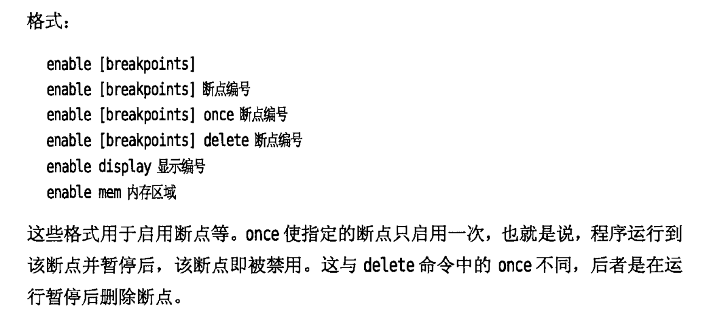

## 断点命令

commands 断点编号

定义在断点中断后自动执行的命令

格式

commands 断点编号

命令

...

end

程序在指定的断点暂停后，就会自动执行命令。下面的例子是在断点处暂停时执行p *iseq(打印iseq)

这里以这段代码为例

~~~c
#include<stdio.h>
#include<unistd.h>c
int main(void)
{
    int a =10;
    a++;
    printf("%d",a);
    return 0;
}
~~~

设置断点后的命令

~~~
(gdb) commands 3 
Type commands for breakpoint(s) 3, one per line.
End with a line saying just "end".
>p a
>end
~~~

重新运行

~~~
(gdb) run
The program being debugged has been started already.
Start it from the beginning? (y or n) y
Starting program: /home/gdbLearning/a ./a
warning: Probes-based dynamic linker interface failed.
Reverting to original interface.

Breakpoint 3, main () at a.c:4
4       {
$2 = 0
~~~

可以和silent组合使用，暂停显示执行复杂的显示动作

## 常用命令及省略形式（别名）

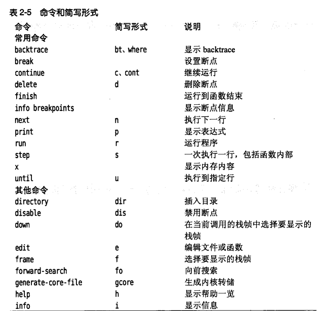

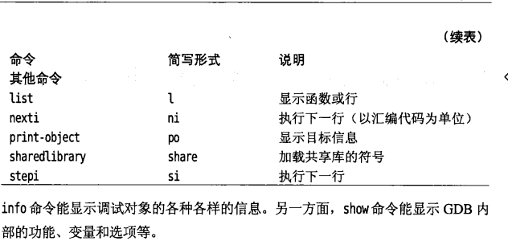

## 调试器（GDB）的基本使用方法（之三）

继续介绍Linux下GDB的使用技巧

### 值的历史

print命令显示得值会记录在值历史中。

最后得值可以用$访问，如

~~~、
p $
~~~

还有show value显示值历史中得最后10个值，不过不好用，它显示的是曾经显示的所有的最后10个的值

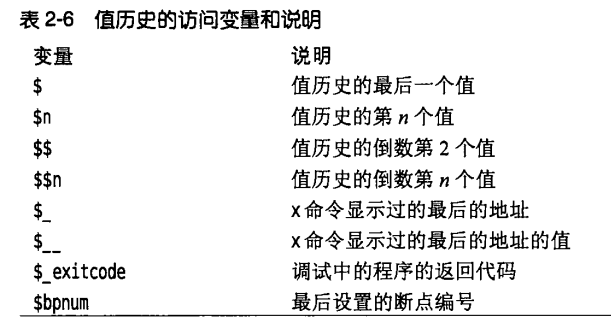

## 变量

变量以$开头，由英文字母和数字组成

set $i=0

## 命令历史

可以将命令历史保存在文件中

## 初始化文件（.gdbinit）----不懂

linux环境下的初始化文件为.gdbinit。如果存在，GDB就会在启动之前将其作为命令文件运行。初始化文件和命令文件的运行顺序如下：

1. $HOME/.gdbinit
2. 运行命令行选项
3. ./.gdbinit
4. 通过-x选项给出的命令文件。

## 命令定义

利用define自定义命令，使用document给自定义命令添加说明。help+命令名 可以查看定义的命令。

还可以吧各种设置写在文件中，运行调试器时读取这些文件。

格式

source  文件名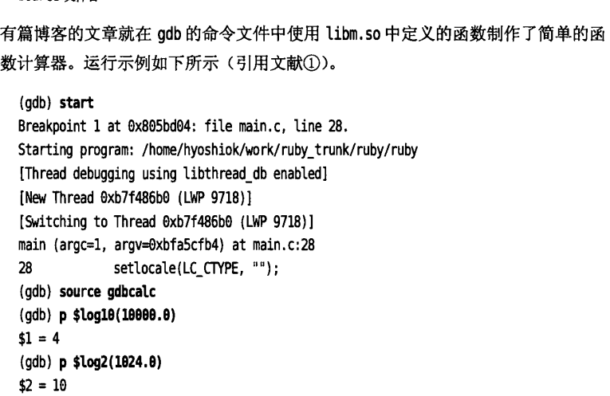

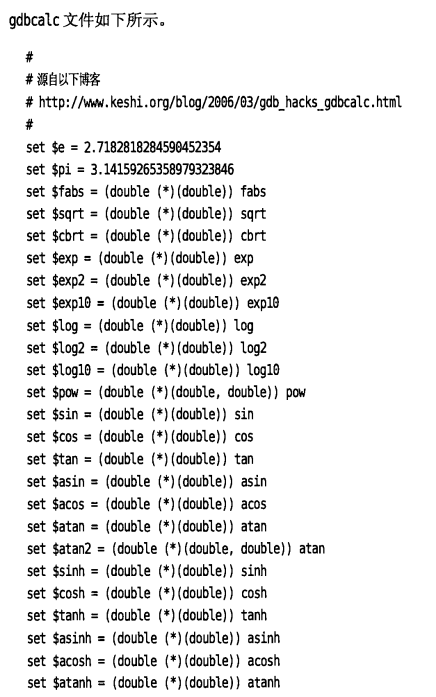

 
