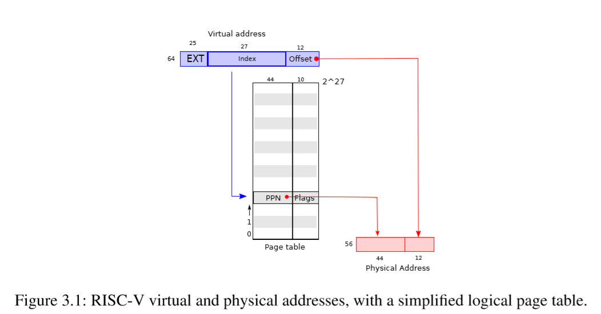
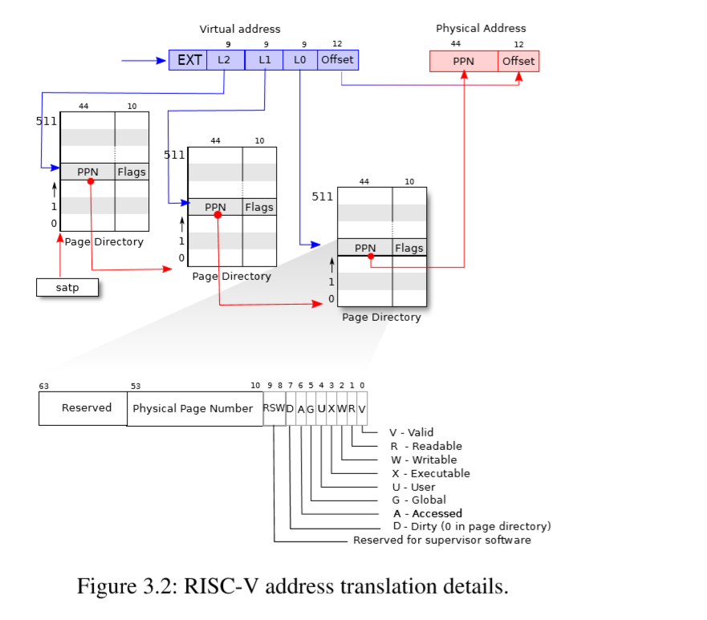
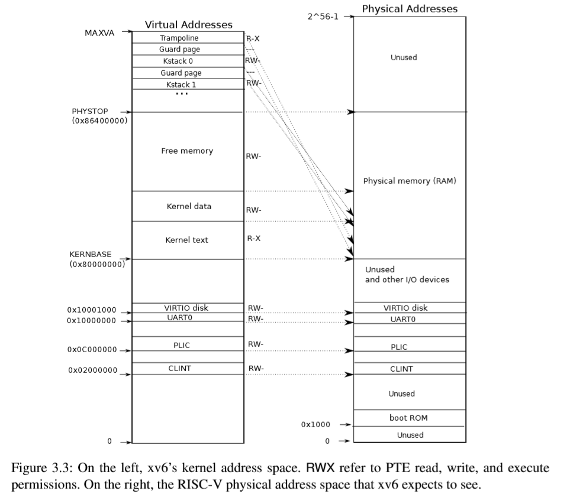
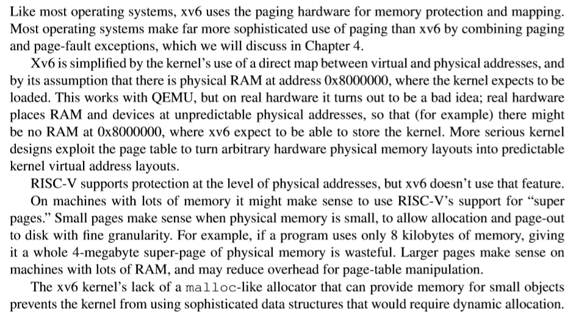
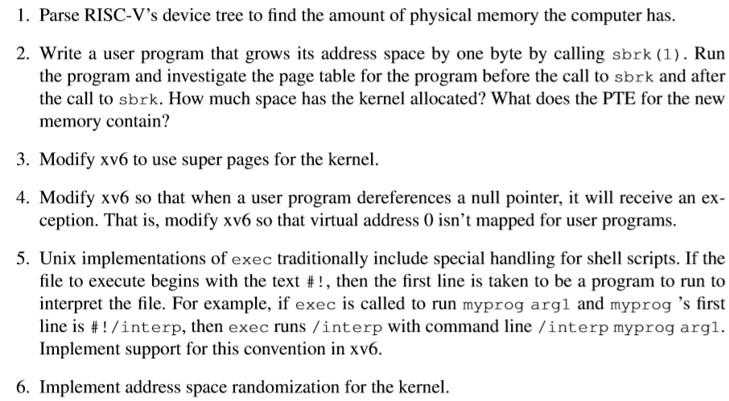

# lec4-Virtual Memroy

准备工作，阅读【1】中第3章；阅读memlayout.h【2】；阅读vm.c【3】；阅读kalloc【4】；阅读riscv.h【5】；阅读exec.c【6】

<!--more-->

【1】https://pdos.csail.mit.edu/6.828/2020/xv6/book-riscv-rev1.pdf

【2】https://github.com/mit-pdos/xv6-riscv/blob/riscv/kernel/memlayout.h

【3】https://github.com/mit-pdos/xv6-riscv/blob/riscv/kernel/vm.c

【4】https://github.com/mit-pdos/xv6-riscv/blob/riscv/kernel/kalloc.c

【5】https://github.com/mit-pdos/xv6-riscv/blob/riscv/kernel/riscv.h

【6】https://github.com/mit-pdos/xv6-riscv/blob/riscv/kernel/exec.c

<!--more-->

## Chapter 3

page table是一种实现让进程拥有自己的地址空间和内存的机制。实现进程间的隔离性。

### 3.1 paging hardware

xv6中64bit的虚拟地址只有低39位被使用了。逻辑上，page table是一组大小为2^(27)个page table entries（PTEs）的数组，每个PTE包含一个44位的physical page number(PPN)以及一些flags。paging hardware将虚拟地址39bit中的前27位映射到page table 中去找到PTE，然后得到一个56位的物理地址，其中高44bits来自PTE中的PPN，低12位来自原虚拟地址的offset，如图所示。

页表使操作系统能够以4096（2^12）字节的对齐块粒度控制虚拟地址到物理地址的转换，这样的块称为page.

在图3.2可以看到，实际转换过程有3步。The root of the tree is a 4096-byte page-table page that contains 512 PTEs, which contain the physical addresses for page-table pages in the next level of the tree.意思就是虚拟地址L2 L1 L0的9位去寻找在page directory中的PTE，这个page directory有4096个字节，包含512个PPN。

如果3个PTEs中的任何一个想映射一个不存在的地址，paging hardware 就会抛出一个 page-fault exception到内核，让内核去处理（见chapter 4）。每一个PTE都有flag bits告诉paging hardware相关联的虚拟地址的使用权限。

- **PTE_V** indicates whether the PTE is present: if it is not set, a reference to thepagecausesanexception(i.e.isnotallowed). 
- **PTE_R** controlswhetherinstructionsareallowed to read to the page. 
- **PTE_W** controls whether instructions are allowed to write to the page. 
- **PTE_W** controls whether instructions are allowed to write to the page. 
- **PTE_U** controls whether instructions in user mode are allowed to access the page
- **PTE_U** is not set,the PTE can be used only in supervisor mode（也就是内核态）.

~~~
To tell the hardware to use a page table, the kernel must write the physical address of the root page-table page into the satp register. 
~~~

为了让硬件使用page table,内核必须将root page-table page的物理地址写入satp寄存器。每个CPU有自己的一个satp。所以一个CPU可以运行一个进程。

### 3.2 Kernel address space

Xv6为每一个进程维护一个page table来描述每个进程的用户地址，加上一个单独的page table描述内核地址空间。内核设置了自己的地址空间的layout以此达到获取物理内存和各种硬件资源的虚拟地址。图3.3展示了内核虚拟地址到物理地址的布局映射（layout map），文件（kernel/memlayout.h）声明了xv6的内核内存布局的常数。

QEMU从物理地址0x80000000开始模拟包含RAM（physical memory）的计算机，知道地址在0x86400000，在xv6中称之为PHYSTOP.0x80000000以下的地址都是一些I/O设备，内核直接通过这些设备的物理地址与其进行交互而不是通过RAM。在Chapter 4解释了xv6如何与这些设备进行交互的，与设备进行交互的话，虚拟地址就等于他们的物理地址了。

有一些内核虚拟地址不是直接映射的：

- **The trampoline page.**It is mapped at the top of the virtual address space; user page tables have this same mapping. Chapter 4 discusses the role of the trampoline page, but we see here an interesting use case of page tables; a physical page (holding the trampoline code) is mapped twice in the virtual address space of the kernel: once at top of the virtual address space and once with a direct mapping.
- **The kernel pages.**Each process has its own kernel stack, which is mapped high so that below it xv6 can leave an unmapped guard page. The guard page’s PTE is invalid (i.e., PTE_V isnotset),so that if the kernel overflows a kernel stack,itwill likely cause an exception and the kernel will panic. Without a guard page an overflowing stack would overwrite other kernel memory, resulting in incorrect operation. A panic crash is preferable.

### 3.3 Code:creating an address space

V6中大多数用来操作地址空间和页表（page table）的代码都在*vm.c*文件中（kernel/vm.c）。最核心的数据结构是pagetable_t,实际上是一个指向RISC-V根页表的指针。一个pagetable_t可以是一个内核的page table,或者是一个进程的page table。最核心的一个函数是*walk*,用来找到对于虚拟地址的PTE和*mappages*,mappages为新的映射安装PTEs.以*kvm*开头的函数操作内核页表；以*uvm*开头的函数操作用户页表，其他函数则是两者都有。*copyout*和*copyin*以system call参数的形式将数据复制到用户虚拟地址，或者从用户虚拟地址复制数据；这两个函数在*vm.c*中，因为他们需要显式的将虚拟地址转换为相应的物理内存。

在引导顺序的前期，*main*调用*kvminit*(kernel/vm.c)去创造一个内核页表。这个调用出现在*xv6*将页表置入RISC-V中，所以地址都是直接映射到物理内存.kvminit开始分配一个页表大小的物理内存用来存放root page-table page。然后再调用kvmmap加载内核需要的转换（translations）。这个转换包括内核指令集以及数据，物理地址最高到PHYSOP,这些内存的范围都实际指向了设备（and memory ranges which are actually devices）。

kvmmap（kernel/vm.c:118）调用mappages(kernel/vm.c:149)，这个函数将一定范围的虚拟地址与之对应范围的物理地址的映射加载到页表。<u>**对于该范围内的虚拟地址都是以页面为间隔(单位？)进行单独操作的**</u>（不z理解，原文： It does this separately for each virtual address in the range, **at page intervals**）。对于每个被映射的虚拟地址，mappages调用*walk*函数去找到PTE中对应的地址。然后在初始化PTE去存放相关的physical page number,以及相关的期望的权限（PTE_W,PTE_X,and/or PTE_R）,PTE_V标志这个给PTE是可以获取到的(valid)（kernel/vm.c:161）。

*walk*(kernel/vm.c:72)函数模仿了RISC-V paging harware因为它为虚拟地址寻找PTE。*walk* descends the 3-level  page table 9 bits at the time.它利用虚拟地址中每一级level的9 bits去找到下一级page table  或者 final page的PTE（kernel/vm.c:78）。如果这个PTE是无效的，就表示需要的页表没有被分配。如果*alloc*的参数被设置好，*walk*将分配一个新的page-table 并且把它的物理地址放入PTE中。它返回树中最低层级PTE的地址（kernel/vm.c:88）。

上述的代码依赖于被直接映射到内核虚拟地址空间的物理地址。比如，当walk去遍历各层级page table，它直接从PTE(kernel/vm.c:80)拉取下一层级page table的物理地址，接着使用该地址作为一个虚拟地址去得到下一个层级的PTE。

***main*函数调用*kvminithart*（kernel/vm.c:53）去加载内核page table。它将根页表的物理地址写到寄存器*satp*。后面CPU就会根据这个内核页表对地址进行转换，**Since the kernel uses an identity mapping, the now virtual address of the next instruction will map to the right physical memory address。

*procinit*（kernel/proc.c:26），这个函数被main调用，它为每一个进程分配一个内核栈。它将每个栈映射到*KSTACK*生成的虚拟地址，这将为有效的stack-guard留下空间。*kvmmap*将PTEs映射到内核页表(kernel page table)，接着调用*kvminithart*重新加载kernel page table到*satp*，以达到hardware知道新的PTEs。

每个RISC-V CPU 将缓存page table 到TLB（Translation Look-aside Buffer）中，当xv6对page table进行了更改，它必须告诉CPU使得TLB中对应缓存的entries无效（应该指的是PTE）。如果没有这样做，在某一时刻，TLB可能会使用一个旧的缓存的映射，同时将其指向一个phsical page，但是这个physical page已经分配给其他进程了，这样的后果就是，一个进程可能去污染其他进程的内存。RISC-V有一个叫sfence.vma的指令，用以刷新CPU的TLB。xv6在kvminithart中执行sfence.vma在重新加载satp寄存器之后，而在返回到用户空间之前trampoline中的代码会切换到一个用户页表(kernel/trampolin.S:79).

### 3.4 Physical memory allocation

内核在运行过程中必须为页表(page table)、用户内存(user memory)、内核栈(kernel stack)、和管道缓存(pipe buffers)分配和释放物理内存。

xv6使用在内核末端和PHYSOTP之间的物理内存来在运行期间进行分配。一次性分配和释放整个4096字节的page。<u>它将通过将pages形成链表来跟踪哪个page是可以使用的（原文:Since the kernel uses an identity mapping, the now virtual address of the next instruction will map to the right physical memory address）</u>分配过程包含将一个page从链表中移除；释放包含将free page 增加道链表。

### 3.5 Code: Physical memory allocator

分配器在*kalloc.c*(kernel/kalloc.c:1)。这个分配器的数据结构是一个可以分配的物理内存*pages*的*free list* ，每一个free page`s的链表元素是一个*struct run*(kernel/kalloc.c:17)。分配器是如何得到内存去存放那个数据结构的呢？每个free page保留自己的*run*数据结构，因为在那里没有其它东西被存放。这个free list 被一个spin lock(kernel/kalloc.c:21-24)保护。这个list和lock被封装在一个结构体中用来明确锁可以保护结构体中的field。现在忽略lock和*acquire*以及*release*；第6章会将详细讲解lock.

[^]: [!TIP] 对于互斥锁，如果资源已经被占用，资源申请者只能进入睡眠状态。但是自旋锁不会引起调用者睡眠，如果自旋锁已经被别的执行单元保持，调用者就一直循环在那里看是否该自旋锁的保持者已经释放了锁，"自旋"一词就是因此而得名。自旋锁比较适用于锁使用者保持锁时间比较短的情况。正是由于自旋锁使用者一般保持锁时间非常短，因此选择自旋而不是睡眠是非常必要的，自旋锁的效率远高于互斥锁。

函数*main*会调用*kinit*初始化allocator(kernnel/kalloc.c:27)。*kinit*会初始化free list去hold每一个在kernel的末端和PHYSTOP之间的page。xv6应该通过解析硬件提供的配置信息决定还有多少物理内存可以得到。相反，xv6假设这个机器有128兆字节的**RAM**。*kinit*调用freerange通过per-page calls to *kfree*去将空闲的内存加到free list 后。PTE只能引用在4096字节边界上对齐的物理地址（是4096的倍数），因此*freerange*使用PGROUP来确保它只能释放对齐的物理地址。<u>allocator开始没有内存；这些kfree的调用给了它一些去管理。（The allocator starts with no memory; these calls to kfree give it some to manage. ）</u>

allocator有时候将地址当作整型以方便进行算术运算(e.g., traversing all pages in freerange)，有时又将其当作指针去读和写这些内存(e.g.,manipulatingthe run structurestoredineachpage)；

函数kfree(kernel/kalloc.c:47)将所有被释放的内存的每个字节都置为1。这造成了如果代码使用了释放后的内存，将会读取到垃圾内容而不是原来有效的内容。从而希望这种代码更快的break。然后*kfree*将这个page加入到free list: it casts pa to a pointer to *struct run*, records the old start of the free list in r->next, and sets the free list equal to r.  *kalloc* removes and returns the first element in the free list.

### 3.6 Process address space

每个进程都有自己单独的page table，当xv6在切换进程的时候，也会切换page tables。如figure 23所示，一个进程的用户内存从虚拟地址0开始并且最大到MAXVA(kernel/riscv.h:348)，原则上允许进程有256GB大小的内存（因为虚拟地址可以用39位，就是2^39字节）。

当一个进程想xv6要求更多的用户内存的时候，xv6首先会使用*kalloc*去申请physical pages.然后会将PTEs加入进程的page table，这个page table指向新的physical page。Xv6将在这些PTEs中设置PTE_W,PTE_X,PTE_R,PTE_U和PTE_V标志位。大多数进程都用不完整个用户地址空间;xv6在未使用的PTEs中清除PTE_V。

我们会在这里介绍一些page tables的一些漂亮的例子。首先，不同的进程的page tables将用户地址转换为不同的物理内存的pages，因此每个进程有自己的私人用户内存。其次，每个进程将自己的内存是为从0开始连续的虚拟地址，但是进程的物理内存可以不是连续的。第三，内核通过用户地址空间顶部的trampoline代码映射一个page<u>,因此，在所有地址空间中都会显示一页物理内存( thus a single page of physical memory shows up in all address spaces. )。</u>

figure 3.4显示了一个正在xv6中运行的进程的用户内存的更为详细的布局。The stack is a single page, and is shown with the initial contents as created by exec. 包含命令行参数的字符串以及指向他们的指针数组在栈的最上方。在下面是允许一个程序在启动*mian*可以使用的值只要函数*main(argc,argv)*被调用的话。

为了检测一个用户栈溢出分配的栈内存，xv6在栈的正下方放置了一个无效的guard page。如果用户堆栈溢出且进程在堆栈下方使用地址，硬件将生成一个页面错误异常，因为映射无效。在真实世界中的操作系统可能会自动为用户栈分配更多的内存如果发送溢出的话。

### 3.7 Code:sbrk

*sbrk*是一个进程用来缩小或者扩大自己内存的系统函数。这个系统函数是由函数*grwoproc*(kernel/proc.c:239)完成的。*grwoproc*调用*uvmalloc*或者*uvmdealloc*，取决于n是正数还是负数。uvmalloc(kernel/vm.c:229)和*kalloc*一起分配物理内存，并使用*mappages*将PTEs加入到用户表。*uvmalloc*调用*uvmunmap*（kernel/vm.c:174）,它使用*walk*去寻找PTEs以及kfree去释放与之相关的物理内存。

xv6使用page tables不仅是告诉硬件如何映射虚拟地址，而且还是物理内存page被分配到哪个进程的唯一记录。这也是为什么释放用户内存（in uvmunmap）需要检测用户页表。

### 3.8 Code:exec

*Exec*是创造地址空间用户部分的系统调用（之前都是翻译的系统函数，感觉系统调用更加贴切）。它从存储在文件系统中的文件中初始化地址空间的用户部分。*Exec*(kernel/exec.c:13)使用namei(kernel/exec.c:26)打开命名为*path*的二进制地址，在第8章回进行解释。然后它回读取ELF头部（header）。Xv6应用以广泛使用的ELF 格式进行描述（Xv6 applications are described in the widely-used **ELF** format）定义在（kernel/elf.h）。一个ELF二进制由*ELF header,struct elfhd*(kernel/elf.h:6)构成,后面跟着一系列程序部分的headers,*struct proghdr*(kernel/elf.h:25).每个*proghdr*描述了一部分必须加载到内存的应用；xv6程序只有一个program section header,但是其他的系统对于指令和数据有单独的部分。

第一步是快速检测这个文件是否包含ELF二进制。一个ELF binar以四字节的"magic number：*"0x7F,'E','F'*开始，或者*ELF_MAGIC*（kernel/elf.h:3）。如果ELF header有正确的magic number,那么*exec*就假设这个二进制是正确的。

*Exec*使用 *proc_pagetable*(kernel/exec.c:38) 分配一个没有用户映射的新页表，使用 *uvmalloc* (kernel/exec.c:52) 为每个 ELF 段分配内存，并使用 *loadseg* (kernel/exec.c:10) 将每个段加载到内存中/exec.c:10)。*loadseg*使用*walkaddr*去找到分配的内存的物理地址，在分配的内存中可以写入每个page的ELF部分，然后readi去从文件中读取。

这是*/init的*程序段头部（program section header）,/*init*是*exec*创建的第一个用户程序，看起来是这个样子的：

程序部分的header`s的*filesz*可能小于*memsz*,表明之间的gap应该用0来填充（是C的全局变量）而不是从文件中读取。对于/*init*，*filesz*是2112字节，而*memsz*是2136字节，因此*uvmalloc*分配了足够的物理内存去存放2136个字节，但是只从文件/*init*中读取2112个字节。

现在*exec*分配和初始化用户栈。它只分配一个stack page。*Exec*将参数字符串一次性复制到栈顶，在*ustack*中记录指向他们的指针。它将在传入到*main*的*argv*列表（list）的最后的部分放置一个空指针。前三个在*ustack*中的*entries*是<u>假的返回计数器、argc和argv指针( the fake return program counter, argc, and argv pointer).</u>

*Exec*将不可访问page放置在stack page的正下方，因此程序想使用超过一个page就会出错。这个不可访问的page也允许*exec*去处理太大的参数；在这种情况下，*exec*使用copyout将参数复制到这个栈时，copyout将会意识到这个目的page 是不可以访问的，然后返回-1。

在准备新内存镜像（new memory image）的过程中，如果*exec*检测到如无效程序片段之类的错误，它将跳转到标签（label）*bad*,释放这个新的映像，然后返回-1。*Exec*必须等着释放旧的镜像直到系统调用成功：如果旧的镜像消失了，这个系统调用就无法返回-1给*Exec*.这是exec在创建镜像过程中唯一发生的错误示例。一旦镜像准备成功，exec就可以将其提交到新的*page table*(kernel/exec.c:113)以及释放旧的镜像（kernel/exec.c:117）。

*Exec*加载在ELF文件中的字节到ELF文件指定的内存地址中。用户或者进程可以将想要的地址写入ELF文件。所以*exec*具有风险性，因为这个ELF文件可能有意或则无意引用到了kernel。对于粗心的结果就是一次崩溃到病毒对于内核隔离机制的破坏前三个在*ustack*中的*entries*是<u>假的返回计数器、argc和argv指针( the fake return program counter, argc, and argv pointer)</u>。xv6为了避免这种风险进行了一系列的检测。比如 *if(ph.vaddr + ph.memsz  <  ph.vaddr)*检测和是否溢出于64位整型。 这点的危险就在于用户可以创建一个ELF二进制文件，这个文件带有指向用户选择的地址的ph.vaddr，以及足够大的ph.memsz，和可以溢出到0x1000，看起来像是一个无效的值。在旧版本的xv6中，用户地址空间包含了内核（但是在用户模式不能读写），用户可以选择与内核内存对应的地址并将ELF文件的数据复制到这个内核中。在RSC-V版本的xv6，这不会再发生，因为这个内核有自己单独的page table：*loadseg*加载到进程的page table，而不是内核的page table。

It is easy for a kernel developer to omit a crucial check, and real-world kernels have a long history of missing checks whose absence can be exploited by user programs to obtain kernel privileges. It is likely that xv6 doesn’t do a complete job of validating user-level data supplied to the kernel, which a malicious user program might be able to exploit to circumvent xv6’s isolation.

### 3.9 Real world

后面就不翻译了，放图片格式好点。

### 3.10 Exercise

## 总结&笔记

内核栈：在内核内存布局中可以看到有Kstack 0，Kstack 1等字样，这些就是内核栈，他负责保存进程的消息，即存放上下文切换时的信息。当进程A要切换到进程B时，首先要陷入内核，然后内核将CPU中关于进程A的进程信息（即某些寄存器中的值）保存在进程A的内核栈中，然后从进程B的内核栈中恢复进程B的信息到CPU的某些寄存器中，再退出内核模式回到进程B，这样CPU就开始执行进程B了。

在内核栈下面有一段没有被映射的虚拟内存guard page，就是为了防止栈溢出。

TLB:

当xv6更改页表的时候 ，必须告诉CPU相应的缓存TLB条目无效。xv6重新加载satp寄存器后,在kvminithart执行sfence.vma。

**Question:**如果是这样的话，那么在进行两个进程之间的切换的时候，需要CPU运行一段时间的内核，将进程信息保存在寄存器中。
