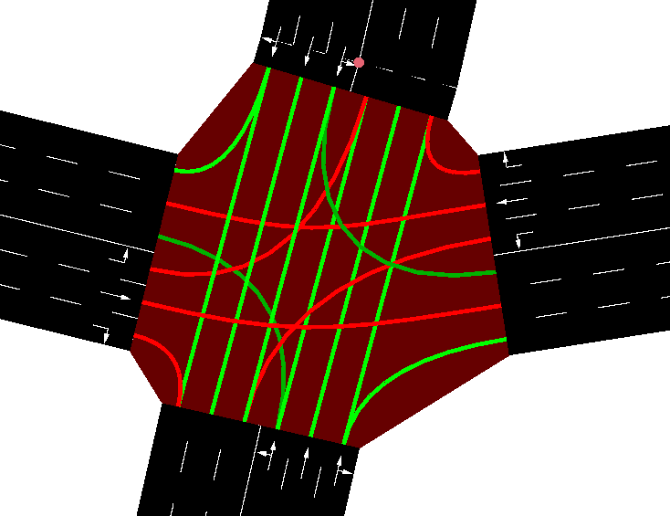

# SUMO交通信号灯

这里可以知道交通信号灯的生成，包括根据交通情况进行变化部分https://sumo.dlr.de/docs/Simulation/Traffic_Lights.html

<!--more-->

在lust.net.xml中可以看到type为actuate的红绿灯的逻辑

~~~xml
    <tlLogic id="-10156" type="actuated" programID="0" offset="0">
        <phase duration="30" state="GGgrrGGG"/>
        <phase duration="4" state="yygrryyy"/>
        <phase duration="10" state="rrGrrrrr"/>
        <phase duration="4" state="rryrrrrr"/>
        <phase duration="30" state="rrrGGGrr"/>
        <phase duration="4" state="rrryyyrr"/>
    </tlLogic>
~~~

而在tll.static.xml中同样ID的红绿灯的设置如下：

~~~xml
    <tlLogic id="-10156" type="static" programID="1" offset="0">
        <phase duration="31" state="GGgrrGGG"/>
        <phase duration="6" state="yygrryyy"/>
        <phase duration="6" state="rrGrrrrr"/>
        <phase duration="6" state="rryrrrrr"/>
        <phase duration="31" state="rrrGGGrr"/>
        <phase duration="6" state="rrryyyrr"/>
    </tlLogic>
~~~

| Attribute Name |              Value Type              |                         Description                          |
| :------------- | :----------------------------------: | :----------------------------------------------------------: |
| **id**         |             id (string)              | The id of the traffic light. This must be an existing traffic light id in the .net.xml file. Typically the id for a traffic light is identical with the junction id. The name may be obtained by right-clicking the red/green bars in front of a controlled intersection. |
| **type**       | enum (static, actuated, delay_based) | The type of the traffic light (fixed phase durations, phase prolongation based on time gaps between vehicles (actuated), or on accumulated time loss of queued vehicles (delay_based) ) |
| **programID**  |             id (string)              | The id of the traffic light program; This must be a new program name for the traffic light id. Please note that "off" is reserved, see below. |
| **offset**     |                 int                  |            The initial time offset of the program            |

上面是对tlLogic中各种属性的说明，可以看到对actuated的说明如下：(fixed phase durations, phase prolongation based on time gaps between vehicles (actuated)，说明这种类型的红绿灯的相位延长是由实际车辆的间隔驱动设置的。

对于信号灯颜色的解释：

| Character |      | Description                                                  |
| :-------: | :--: | :----------------------------------------------------------- |
|     r     |      | 'red light' for a signal - vehicles must stop                |
|     y     |      | 'amber (yellow) light' for a signal - vehicles will start to decelerate if far away from the junction, otherwise they pass |
|     g     |      | 'green light' for a signal, no priority - vehicles may pass the junction if no vehicle uses a higher priorised foe stream, otherwise they decelerate for letting it pass. They always decelerate on approach until they are within the configured [visibility distance](https://sumo.dlr.de/docs/Networks/PlainXML.html#explicitly_setting_which_edge_lane_is_connected_to_which) |
|     G     |      | 'green light' for a signal, priority - vehicles may pass the junction |
|     s     |      | 'green right-turn arrow' requires stopping - vehicles may pass the junction if no vehicle uses a higher priorised foe stream. They always stop before passing. This is only generated for junction type *traffic_light_right_on_red*. |
|     u     |      | 'red+yellow light' for a signal, may be used to indicate upcoming green phase but vehicles may not drive yet (shown as orange in the gui) |
|     o     |      | 'off - blinking' signal is switched off, blinking light indicates vehicles have to yield |
|     O     |      | 'off - no signal' signal is switched off, vehicles have the right of way |

以上是对一个红绿灯相位的解释：

Example: traffic light with the current state **"GrGr"**. The leftmost letter "G" encodes the green light for link 0, followed by red for link 1, green for link 2 and red for link 3. The link numbers are enabled via [sumo-gui settings](https://sumo.dlr.de/docs/sumo-gui.html) by activating *show link tls index*.

每个颜色表示一条同行方向的红绿灯状态。

比如junction ID= -824的路口，有15条通行的方向，所以信号灯一个相位应该有15个，该图的信号状态为：

~~~
GGGGgrrrGGGGgrrr
~~~

## Traffic Lights that respond to traffic

### Type 'actuated'

<u>SUMO supports *gap-based* actuated traffic control.</u>这句话说明了类型为actuated类型信号灯是根据车辆间隔来动态规划的。当检测到一个连续通过的车流的时候，就会延长当前相位的红绿灯时间，当检测到连续的车辆之前有充足的时间间隔的时候就会进入下一个相位。

| Attribute Name |           Value Type            |                         Description                          |
| :------------: | :-----------------------------: | :----------------------------------------------------------: |
|  **duration**  |           time (int)            |                  The duration of the phase                   |
|   **state**    |      list of signal states      |      The traffic light states for this phase, see below      |
|     minDur     |           time (int)            | The minimum duration of the phase when using type **actuated**. **Optional, defaults to duration.** |
|     maxDur     |           time (int)            | The maximum duration of the phase when using type **actuated**. **Optional, if minDur is not set it defaults to duration , otherwise to 2147483.** |
|      name      |             string              | An optional description for the phase. This can be used to establish the correspondence between SUMO-phase-indexing and traffic engineering phase names. |
|      next      | list of phase indices (int ...) | The next phase in the cycle after the current. This is useful when adding extra transition phases to a traffic light plan which are not part of every cycle. Traffic lights of type 'actuated' can make use of a list of indices for selecting among alternative successor phases. |

**在该实验中，minDur和maxDur都没有设置，所以minDur 的值和duration相等，而maxDur也等于duration。**

**这是一个官方的例子，其中param的值都是默认值。**

~~~xml
<tlLogic id="0" programID="my_program" offset="0" type="actuated">
  <param key="max-gap" value="3.0"/>
  <param key="detector-gap" value="2.0"/>
  <param key="passing-time" value="2.0"/>
  <param key="vTypes" value=""/>
  <param key="show-detectors" value="false"/>
  <param key="file" value="NULL"/>
  <param key="freq" value="300"/>
  <param key="jam-threshold" value="-1"/>
  <param key="detector-length" value="0"/>  

  <phase duration="31" minDur="5" maxDur="45" state="GGggrrrrGGggrrrr"/>
  ...
</tlLogic>
~~~

对参数的解释：

- **max-gap**: the maximum time gap between successive vehicles that will cause the current phase to be prolonged (within maxDur limit)
- **detector-gap**: determines the time distance between the (automatically generated) detector and the stop line in seconds (at each lanes maximum speed).
- **passing-time**: estimates the headway between vehicles when passing the stop line. This sets an upper bound on the distance between detector and stop line according to the formula `(minDur / passingTime + 0.5) / 7.5`. The intent of this bound is to allow all vehicles between the detector and the stop line to pass the intersection within the minDur time. A warning will be issued if the minDur gives insufficient clearing time.
- **linkMaxDur:X** (where X is a traffic light index): This sets an additional maximum duration criterion based on individual signals green duration rather than phase duration.
- ~~**linkMinDur:X** (where X is a traffic light index): This sets an additional minimum duration criterion based on individual signals green duration rather than phase duration.~~
- **show-detectors** controls whether generated detectors will be visible or hidden in [sumo-gui](https://sumo.dlr.de/docs/sumo-gui.html). The default for all traffic lights can be set with option **--tls.actuated.show-detectors**. It is also possible to toggle this value from within the GUI by right-clicking on a traffic light.
- parameters **vTypes**, **file** and **freq** have the same meaning as for [regular induction loop detectors](https://sumo.dlr.de/docs/Simulation/Output/Induction_Loops_Detectors_(E1).html).
- **coordinated** (true/false) Influence there reference point for time-in-cycle when using [coordination](https://sumo.dlr.de/docs/Simulation/Traffic_Lights.html#coordination)
- **cycleTime** sets the cycle time (in s) when using [coordination](https://sumo.dlr.de/docs/Simulation/Traffic_Lights.html#coordination). Defaults to the sum of all phase 'durations' values.
- **jam-threshold**: ignore detected vehicles if they have stood on a detector for the given time or more (activated by setting a position value)
- **detector-length**: set detector length to the given value (to ensure robust request detection with varying gaps and vehicle positions)

Some parameters are only used when a signal plan with [dynamic phase selection](https://sumo.dlr.de/docs/Simulation/Traffic_Lights.html#dynamic_phase_selection_phase_skipping) is active:

- **inactive-threshold** (default 180): The parameter sets the time in s after which an inactive phase will be entered preferentially.
- **linkMinDur:X** (where X is a traffic light index): This sets an additional minimum duration criterion based on individual signals rather than phase duration

对该属性值进行解释：

- parameters **vTypes**, **file** and **freq** have the same meaning as for [regular induction loop detectors](https://sumo.dlr.de/docs/Simulation/Output/Induction_Loops_Detectors_(E1).html).

| Attribute Name      | Value Type | Description                                                  |
| ------------------- | ---------- | ------------------------------------------------------------ |
| period (alias freq) | int (time) | The aggregation period the values the detector collects shall be summed up (*default: whole simulation time*). |
| vTypes              | string     | space separated list of vehicle type ids to consider, "" means all; default "". |

## 总结actuated类型红绿灯的运行规则的解释（Lust数据集中actuated）

首先要使用actuated类型红绿灯，就得在车道前设置一个detector,它离stop line的距离是以该车道最高速度行驶2s的距离，detector会检测所有的车辆，检测器的长度为0。

所以，延长当前红绿灯状态的规则就是，如果连续车辆之前的最大间距没有超过3s，当前红绿灯会延长一个相位，即在重复一遍，后面不会再重复而是直接进入下一个红绿灯状态（下一个phase）。

