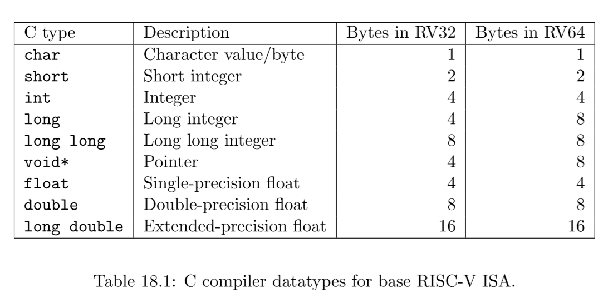
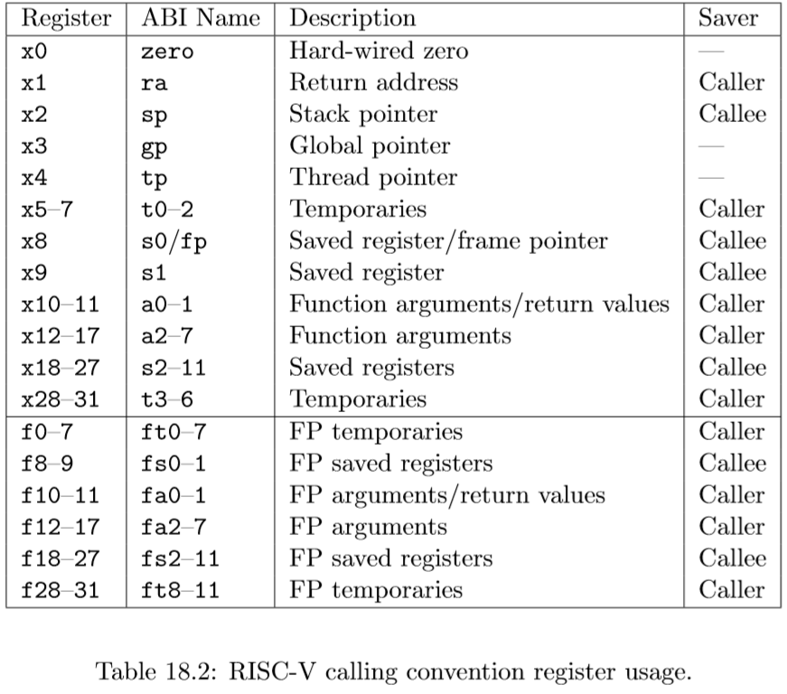
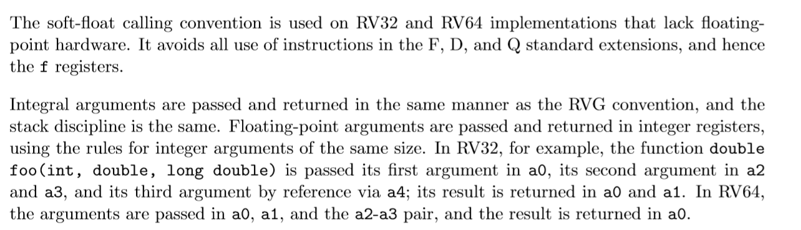

# RISC-V Calling Convention and Stack Frames

**Preparation**: Read [Calling Convention](https://pdos.csail.mit.edu/6.S081/2021/readings/riscv-calling.pdf)

<!--more-->

## Chapter 18

### Calling Convention

#### 18.1 C Datatypes and Alignment

主要讲RV32和RV64架构中各种C类型的长度，int 都是32位，而longs 和浮点数则是和整型寄存器长度一致，所以再RV32中，它们都是32位，而在RV64他们则是64位。后面不翻译了。

#### 18.2 RVG Calling Convention 

RISC-V尽可能使用寄存器传递参数，最多使用8个整型寄存器（a0-a7）,以及8个浮点寄存器fa0-fa7。

如果传入一个函数的参数被概念化为一个C结构体的字段，*每个指针对齐，参数寄存器是前8个结构体指针字的映射（ each with pointer alignment, the argument registers are a shadow of the first eight pointer-words of that struct）*。如果参数i<8是浮点类型，将会传给浮点寄存器fa*i*,否则将会传给整型寄存器a*i*.不过，如果一个浮点参数如果是unions或者数组结构的一部分，将会传给整型寄存器。<u>没懂结尾这句话：*Additionally, floating-point arguments to variadic functions (except those that are explicitly named in the parameter list) are passed in integer registers.*</u>

RISC-V是小端存储的。当一个参数是2倍于pointer-word大小时候，需要对齐。当他们被传入到整型寄存器，他们会被存放到一个奇数和偶数寄存器，偶数寄存器会存放较低的比特位。比如再RV32中，有一个函数 ***void foo(int ,long long)***,第一个参数被存放在a0,第二个参数存放在a2和a3，a1是没有传入的。

超过pointer word两倍大小的参数以引用形式传递。

没有被传入寄存器的struct部分会被传到栈上，栈指针sp会指向第一个没有在寄存器的参数。

函数返回值会存放在整型寄存器a0和a1，以及浮点数寄存器fa0和fa1。只有当浮点数返回值是原子的或者是一个结构体成员，这个结构体只包含1个或者2个浮点值，他们才会存放在浮点数寄存器。其他返回值如是2倍pointer-words的会返回到a0和a1。更大的返回值就会返回在内存；调用者分配这个内存区域，并将指向它的指针作为隐式参数传给被调用者。

在standard RISC-V calling convention,栈式向下增长的，栈指针总是保持16字节对齐。

除了参数寄存器和返回值寄存器之外，有7个整型寄存器t0-t6和12个浮点数寄存器ft0-ft11是暂时的寄存器，在调用之间是易失的寄存器，如果以后使用，调用方必须保存这些寄存器。十二个整数寄存器s0–s11和十二个浮点寄存器fs0–fs11在调用之间保留，如果使用，被调用方必须保存。表18.2展示了每个整型寄存器和浮点数寄存器在调用约定（calling convention）中的角色。

#### 18.3 Soft-Float Calling Convention

The dynamic rounding mode and accrued exception flags are accessed through the routines provided by the C99 header fenv.h.

大意就是这个soft-float calling convention为了应对缺少浮点硬件。会将太大的浮点参数以引用的形式传到整型寄存器。

#### 总结：

看的懵懵懂懂。不过也对函数调用中参数如何传递，以及结果如何保存有了一些认识。

